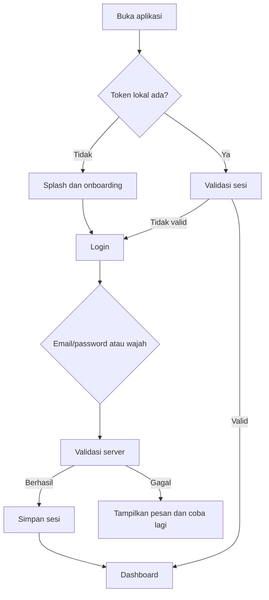
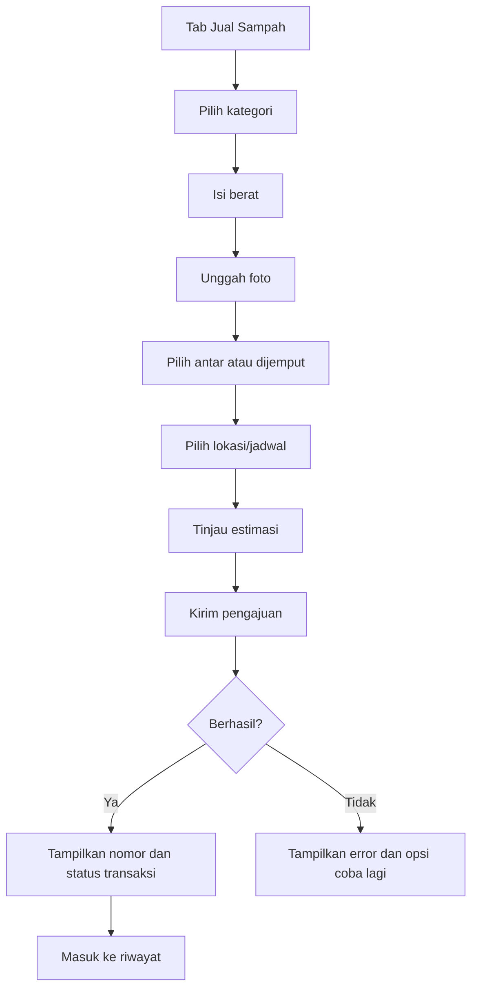
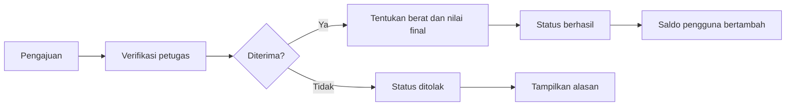
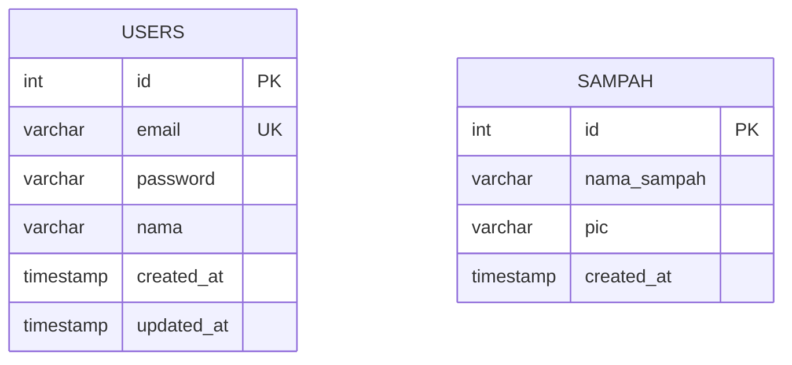
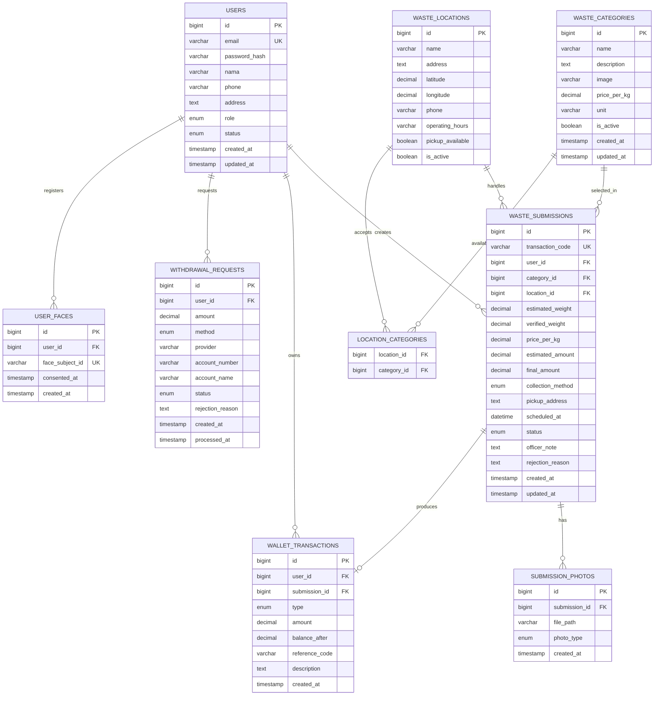

# Product Requirements Document (PRD)

## Bank Sampah Digital

| Informasi | Nilai |
|---|---|
| Dokumen | Product Requirements Document |
| Versi | 1.0 |
| Tanggal | 19 Juni 2026 |
| Status | Draft berdasarkan implementasi saat ini |
| Produk | Aplikasi mobile Bank Sampah Digital Sungailiat |
| Frontend | Flutter, Material 3 |
| Backend utama | Node.js, Express, MySQL |
| Layanan tambahan | Face recognition dan chatbot/NLP |
| Bahasa utama | Bahasa Indonesia |

---

## 1. Ringkasan Produk

Bank Sampah Digital adalah aplikasi mobile yang membantu masyarakat mengubah sampah anorganik menjadi saldo digital. Pengguna dapat masuk ke aplikasi, melihat jenis sampah, mengajukan penjualan sampah, memilih metode pengantaran atau penjemputan, mencari lokasi bank sampah, memantau transaksi, menarik saldo, serta mengakses edukasi lingkungan dan chatbot.

Implementasi saat ini telah memiliki alur antarmuka yang cukup lengkap, tetapi baru sebagian fitur yang terhubung ke backend. Login, sesi pengguna, login wajah, chatbot, dan CRUD data jenis sampah telah memiliki integrasi API. Pengajuan jual sampah, lokasi, saldo, riwayat, edukasi, produk UMKM, dan komunitas masih menggunakan data statis atau interaksi simulasi.

PRD ini menjadi sumber kebutuhan produk untuk penyusunan `desain.md`, desain UI/UX, pengembangan API berikutnya, dan penyelarasan struktur database.

---

## 2. Sumber Analisis

Dokumen ini disusun berdasarkan:

- Kode Flutter pada folder `flutter_api_node/lib`.
- Backend Node.js pada `bank_sampah_api/app.js`.
- Konfigurasi database pada `bank_sampah_api/db.js`.
- Dump MySQL `kepl_api_test (1).sql` yang dibuat pada 17 Juni 2026.
- Tema visual pada `flutter_api_node/lib/app_theme.dart`.

---

## 3. Kondisi Produk Saat Ini

### 3.1 Fitur yang sudah terhubung

| Fitur | Kondisi |
|---|---|
| Splash screen | Sudah tersedia |
| Onboarding tiga halaman | Sudah tersedia |
| Login email dan password | Terhubung ke `POST /login` |
| Penyimpanan sesi | Menggunakan `SharedPreferences` |
| Login wajah | Menggunakan face service dan `POST /face-login` |
| Logout | Menghapus token dan ID pengguna |
| Daftar jenis sampah | Terhubung ke `GET /sampah` |
| Tambah jenis sampah dan foto | Terhubung ke `POST /sampah` |
| Edit jenis sampah dan foto | Terhubung ke `PUT /sampah/:id` |
| Hapus jenis sampah | Terhubung ke `DELETE /sampah/:id` |
| Chatbot | Terhubung ke `POST /chat` pada layanan NLP |

### 3.2 Fitur yang masih berupa prototype

| Fitur | Kondisi |
|---|---|
| Registrasi akun | Form tersedia, belum mengirim data ke API |
| Ringkasan saldo | Nilai masih statis, yaitu Rp85.000 |
| Total kontribusi sampah | Dihitung dari jumlah kategori, belum dari transaksi |
| Pengajuan jual sampah | Form dan estimasi tersedia, belum disimpan |
| Lokasi bank sampah | Data, pencarian, filter, dan peta masih statis |
| Riwayat transaksi | Data dan filter masih statis |
| Tarik saldo | Validasi lokal dan notifikasi saja |
| Edit profil | Menu tersedia, belum memiliki halaman/aksi |
| Edukasi dan progres belajar | Konten statis |
| Produk UMKM | Katalog statis, tombol beli belum aktif |
| Komunitas | Post, dukungan, dan komentar masih statis |

### 3.3 Layanan aplikasi

| Layanan | Alamat pada kode saat ini | Fungsi |
|---|---|---|
| API utama | `http://192.168.1.15:3000` | Login dan CRUD sampah |
| NLP API | `http://192.168.1.15:8000` | Chatbot |
| Face API | `http://192.168.1.15:5000` | Pengenalan wajah |

Alamat layanan masih hard-coded dan harus dipindahkan ke konfigurasi environment sebelum aplikasi digunakan di luar jaringan pengembangan.

---

## 4. Masalah yang Ingin Diselesaikan

Masyarakat sering mengalami hambatan berikut:

- Tidak mengetahui jenis sampah yang diterima dan nilai per kilogramnya.
- Tidak mengetahui lokasi bank sampah yang paling sesuai.
- Proses pencatatan setoran dan saldo kurang transparan.
- Kesulitan memantau status verifikasi sampah.
- Kurang mendapat edukasi praktis tentang pemilahan sampah.
- Tidak memiliki kanal bantuan cepat saat menggunakan layanan bank sampah.

Pengelola bank sampah juga membutuhkan data pengguna, kategori sampah, pengajuan, hasil verifikasi, dan saldo yang konsisten dalam satu sistem.

---

## 5. Visi Produk

Menjadi layanan bank sampah digital yang mudah digunakan, transparan, dan edukatif, sehingga masyarakat dapat mengelola sampah sebagai aset sekaligus meningkatkan kontribusi terhadap kebersihan lingkungan Sungailiat.

---

## 6. Tujuan Produk

### 6.1 Tujuan utama

- Memungkinkan pengguna mengajukan penjualan sampah dalam waktu kurang dari tiga menit.
- Menampilkan estimasi nilai sampah sebelum pengajuan dikirim.
- Menyediakan status transaksi yang mudah dipahami.
- Memberikan transparansi saldo masuk dan saldo keluar.
- Membantu pengguna menemukan lokasi bank sampah.
- Memberikan edukasi dan bantuan terkait pemilahan sampah.

### 6.2 Sasaran keberhasilan

| Metrik | Target awal |
|---|---|
| Pengguna berhasil menyelesaikan login | ≥ 95% dari percobaan valid |
| Pengajuan jual sampah selesai | ≥ 80% dari pengguna yang membuka form |
| Waktu rata-rata membuat pengajuan | < 3 menit |
| Pengajuan yang memiliki foto | ≥ 80% |
| Pengguna yang melihat status transaksi | ≥ 50% pengguna aktif bulanan |
| Kegagalan API pada alur utama | < 2% |
| Waktu respons API utama | < 2 detik pada kondisi normal |

### 6.3 Bukan tujuan versi awal

- Sistem pembayaran langsung melalui payment gateway.
- Logistik penjemputan dengan pelacakan kendaraan secara real-time.
- Marketplace lengkap dengan keranjang dan pengiriman.
- Media sosial komunitas dengan moderasi penuh.
- Sistem administrasi bank sampah yang lengkap di aplikasi pengguna.

---

## 7. Pengguna dan Peran

### 7.1 Nasabah bank sampah

Pengguna utama yang ingin menjual sampah, mendapatkan saldo, mencari lokasi, melihat riwayat, dan belajar memilah sampah.

Kebutuhan utama:

- Proses cepat dan sederhana.
- Informasi harga serta status yang jelas.
- Rasa aman terhadap akun dan saldo.
- Bantuan saat mengalami kesulitan.

### 7.2 Petugas atau admin bank sampah

Pengguna operasional yang memverifikasi pengajuan, menentukan berat dan nilai final, mengelola kategori serta harga, dan memproses penarikan saldo.

Catatan: antarmuka admin belum tersedia dalam repository saat ini. Kebutuhannya tetap memengaruhi status transaksi dan struktur data.

### 7.3 Keputusan akses kategori sampah

Pada implementasi sekarang, setiap pengguna dapat menambah, mengedit, dan menghapus data `sampah` miliknya. Untuk produk produksi, data kategori dan harga sebaiknya dikelola oleh admin, sedangkan nasabah hanya melihat dan memilih kategori aktif.

Untuk desain versi saat ini:

- Tombol tambah, edit, dan hapus kategori dapat tetap didokumentasikan sebagai fitur prototype.
- `desain.md` harus menandai fitur tersebut sebagai fitur admin atau mode pengelolaan, bukan aksi utama nasabah.

---

## 8. Ruang Lingkup dan Prioritas

### 8.1 Prioritas P0 — wajib untuk MVP

- Splash dan pemeriksaan sesi.
- Onboarding.
- Login email/password.
- Login wajah.
- Registrasi pengguna.
- Dashboard berbasis data aktual.
- Daftar kategori dan harga sampah.
- Pengajuan jual sampah.
- Upload foto sampah.
- Pemilihan metode antar atau jemput.
- Pemilihan lokasi bank sampah.
- Riwayat dan detail transaksi.
- Status verifikasi transaksi.
- Saldo dan riwayat saldo.
- Tarik saldo.
- Profil dan logout.
- State loading, kosong, error, dan offline.

### 8.2 Prioritas P1 — penting setelah MVP

- Pencarian serta filter lokasi.
- Navigasi ke aplikasi peta.
- Edit profil.
- Chatbot bantuan.
- Artikel edukasi.
- Progres belajar dan kuis.
- Notifikasi perubahan status pengajuan.

### 8.3 Prioritas P2 — pengembangan lanjutan

- Produk UMKM.
- Komunitas.
- Badge kontribusi.
- Kampanye dan bonus saldo.
- Komentar serta dukungan pada post.

---

## 9. Arsitektur Informasi

```text
Splash
└── Onboarding
    ├── Login
    │   ├── Login email/password
    │   ├── Login wajah
    │   ├── Lupa password
    │   └── Registrasi
    └── Dashboard
        ├── Beranda
        │   ├── Saldo
        │   ├── Riwayat
        │   ├── Kategori sampah
        │   └── Chatbot
        ├── Jual Sampah
        │   └── Konfirmasi pengajuan
        ├── Lokasi
        │   └── Detail/arahkan ke lokasi
        ├── Edukasi
        │   ├── Artikel
        │   ├── Kuis
        │   ├── Produk UMKM
        │   └── Komunitas
        └── Profil
            ├── Edit profil
            ├── Saldo dan tarik saldo
            ├── Riwayat transaksi
            ├── Bantuan
            ├── Tentang aplikasi
            └── Logout
```

Navigasi utama menggunakan lima tab:

1. Beranda
2. Jual Sampah
3. Lokasi
4. Edukasi
5. Profil

---

## 10. Kebutuhan Fungsional

### FR-01 — Splash dan sesi

**Prioritas:** P0

Kebutuhan:

- Sistem menampilkan splash screen dengan identitas Bank Sampah Digital.
- Sistem membaca token lokal saat aplikasi dibuka.
- Pengguna dengan token aktif diarahkan ke dashboard.
- Pengguna tanpa token diarahkan ke onboarding, kemudian login.
- Bila token kedaluwarsa atau ditolak server, sesi harus dibersihkan dan pengguna diarahkan ke login.

Kriteria penerimaan:

- Splash tidak berhenti tanpa batas.
- Perpindahan halaman tidak menghasilkan halaman ganda pada navigation stack.
- Pengguna tidak dapat membuka dashboard setelah sesi tidak valid.

### FR-02 — Onboarding

**Prioritas:** P0

Isi onboarding:

1. Jual sampah dengan mudah.
2. Dapatkan saldo digital.
3. Bantu lingkungan lebih bersih.

Kebutuhan:

- Pengguna dapat berpindah halaman dengan swipe atau tombol lanjut.
- Tombol “Lewati” langsung menuju login.
- Tombol terakhir berubah menjadi “Mulai Sekarang”.
- Pada versi produksi, status onboarding sudah dilihat disimpan agar tidak selalu muncul.

### FR-03 — Login email dan password

**Prioritas:** P0

Kebutuhan:

- Form memiliki email dan password.
- Kedua field wajib diisi.
- Password dapat ditampilkan atau disembunyikan.
- Tombol login menampilkan loading saat request berjalan.
- Login berhasil menyimpan token, `user_id`, email, dan nama pengguna.
- Login gagal menampilkan pesan yang jelas tanpa menghapus input email.
- Tombol lupa password membuka alur bantuan atau pemulihan password.

Kriteria penerimaan:

- Kredensial valid mengarahkan pengguna ke dashboard.
- Kredensial tidak valid tidak membuka dashboard.
- Tombol login tidak dapat ditekan berulang saat request berlangsung.

### FR-04 — Login wajah

**Prioritas:** P0

Kebutuhan:

- Aplikasi meminta izin kamera.
- Kamera digunakan untuk mengambil gambar wajah.
- Gambar dikirim ke face recognition service.
- Hasil pengenalan yang valid ditukar dengan token dari API utama.
- Pengguna menerima pesan jika wajah tidak dikenali, kamera ditolak, atau server tidak tersedia.
- Tombol menampilkan status “Memeriksa wajah...” selama proses.

Kriteria keamanan:

- API utama tidak boleh mempercayai `user_id` dari client tanpa bukti hasil verifikasi yang ditandatangani oleh face service.
- Foto wajah tidak disimpan permanen tanpa persetujuan pengguna.

### FR-05 — Registrasi

**Prioritas:** P0

Field:

- Nama lengkap.
- Nomor HP.
- Email.
- Password.
- Konfirmasi password.
- Alamat.

Kebutuhan:

- Semua field wajib diisi.
- Format email dan nomor HP divalidasi.
- Password minimal delapan karakter.
- Konfirmasi password harus sama.
- Email harus unik.
- Setelah berhasil, pengguna diarahkan ke login atau langsung masuk sesuai keputusan produk.
- Bila akun membutuhkan aktivasi admin, status tersebut harus ditampilkan secara jelas.

Catatan gap:

- Tabel `users` saat ini belum memiliki kolom nomor HP, alamat, status akun, atau data wajah.
- Backend saat ini belum memiliki endpoint registrasi.

### FR-06 — Beranda

**Prioritas:** P0

Beranda menampilkan:

- Sapaan dan identitas singkat pengguna.
- Saldo digital.
- Total kontribusi dalam kilogram.
- Jumlah transaksi atau kategori yang relevan.
- Aksi cepat: jual sampah, cari lokasi, tarik saldo, dan edukasi.
- Kampanye aktif.
- Daftar kategori sampah.
- Pencarian kategori.
- Riwayat terbaru.
- Tombol chatbot.
- Pull-to-refresh.

Kebutuhan:

- Semua angka berasal dari data API, bukan konstanta.
- Ringkasan harus memiliki skeleton/loading, empty state, dan error state.
- Riwayat terbaru maksimal tiga sampai lima transaksi.
- Data pribadi tidak boleh menggunakan fallback akun admin.

### FR-07 — Kategori sampah

**Prioritas:** P0

Data kategori minimum:

- Nama kategori.
- Foto.
- Harga per kilogram.
- Status aktif.
- Satuan.
- Deskripsi atau persyaratan kondisi sampah.

Kebutuhan nasabah:

- Melihat daftar kategori aktif.
- Mencari berdasarkan nama.
- Melihat foto dan harga.

Kebutuhan admin/prototype:

- Menambah kategori.
- Mengedit nama dan foto.
- Menghapus atau menonaktifkan kategori.
- Mendapat dialog konfirmasi sebelum menghapus.

Aturan:

- Nama kategori wajib diisi.
- Foto opsional, tetapi placeholder harus tersedia.
- Penghapusan kategori yang telah dipakai transaksi sebaiknya berupa soft delete.

### FR-08 — Pengajuan jual sampah

**Prioritas:** P0

Input:

- Jenis sampah.
- Berat perkiraan dalam kilogram.
- Foto sampah.
- Metode pengumpulan: antar atau dijemput.
- Lokasi bank sampah.
- Alamat penjemputan jika metode dijemput.
- Jadwal bila diperlukan.

Ringkasan:

- Jenis.
- Berat.
- Metode.
- Lokasi.
- Harga per kilogram.
- Estimasi saldo.

Aturan bisnis:

- Berat harus lebih dari nol.
- Nilai estimasi dihitung dari berat perkiraan dikali harga kategori.
- Nilai final ditentukan setelah verifikasi petugas.
- Foto wajib untuk metode penjemputan dan direkomendasikan untuk metode antar.
- Lokasi harus menerima kategori yang dipilih.
- Pengguna harus menyetujui bahwa nilai yang tampil masih berupa estimasi.
- Pengajuan berhasil menghasilkan nomor transaksi.

Status transaksi:

```text
draft
→ submitted
→ waiting_verification
→ processing
→ completed

Cabang kegagalan:
submitted/waiting_verification/processing → rejected

Pembatalan:
submitted/waiting_verification → cancelled
```

Kriteria penerimaan:

- Pengguna tidak dapat mengirim pengajuan dengan berat nol.
- Tombol kirim terkunci ketika request sedang berjalan.
- Pengajuan berhasil tampil pada riwayat.
- Kegagalan jaringan tidak menghasilkan transaksi duplikat.

### FR-09 — Lokasi bank sampah

**Prioritas:** P1

Data lokasi:

- Nama lokasi.
- Alamat.
- Koordinat latitude dan longitude.
- Jarak dari pengguna.
- Jam operasional.
- Nomor kontak.
- Status buka/tutup.
- Kategori yang diterima.
- Dukungan layanan antar atau jemput.

Kebutuhan:

- Pengguna dapat mencari nama lokasi atau kecamatan.
- Pengguna dapat memfilter berdasarkan jarak, jam buka, dan kategori.
- Pengguna dapat melihat lokasi dalam daftar dan peta.
- Tombol arah membuka aplikasi peta.
- Aplikasi meminta izin lokasi hanya saat diperlukan.

### FR-10 — Riwayat dan detail transaksi

**Prioritas:** P0

Kebutuhan:

- Daftar transaksi menampilkan tanggal, kategori, berat, nilai, dan status.
- Pengguna dapat mencari berdasarkan kategori atau status.
- Pengguna dapat memfilter status.
- Pengguna dapat membuka detail transaksi.

Detail transaksi minimum:

- Nomor transaksi.
- Waktu pengajuan.
- Foto.
- Kategori.
- Berat perkiraan dan berat hasil verifikasi.
- Harga per kilogram.
- Nilai estimasi dan nilai final.
- Metode.
- Lokasi atau alamat penjemputan.
- Timeline status.
- Catatan petugas.
- Alasan penolakan bila ditolak.

### FR-11 — Saldo dan tarik saldo

**Prioritas:** P0

Kebutuhan saldo:

- Menampilkan saldo tersedia.
- Menampilkan saldo tertahan bila ada transaksi belum final.
- Menampilkan riwayat saldo masuk dan keluar.
- Setiap perubahan saldo harus memiliki referensi transaksi.

Kebutuhan tarik saldo:

- Pengguna memilih transfer bank atau e-wallet.
- Pengguna mengisi penyedia layanan, nomor tujuan, nama pemilik, dan nominal.
- Sistem memvalidasi saldo cukup dan batas minimum penarikan.
- Pengguna melihat halaman konfirmasi sebelum mengirim.
- Status penarikan dapat dipantau.

Status penarikan:

- Menunggu.
- Diproses.
- Berhasil.
- Ditolak.
- Dibatalkan.

### FR-12 — Edukasi

**Prioritas:** P1

Kebutuhan:

- Menampilkan tips harian.
- Menampilkan daftar artikel singkat.
- Artikel memiliki judul, gambar, ringkasan, isi, dan tanggal.
- Pengguna dapat membuka detail artikel.
- Progres belajar dihitung dari artikel atau modul yang selesai.
- Kuis memberikan umpan balik benar atau salah sebelum membuka halaman lain.

### FR-13 — Chatbot bantuan

**Prioritas:** P1

Topik utama:

- Cara memilah sampah.
- Jenis sampah yang diterima.
- Cara menjual sampah.
- Penjelasan status transaksi.
- Informasi lokasi dan jam operasional.
- Cara tarik saldo.

Kebutuhan:

- Pesan pengguna langsung muncul pada percakapan.
- Indikator loading tampil selama bot memproses.
- Pesan gagal menyediakan tombol coba lagi.
- Riwayat chat dapat dipertahankan selama sesi.
- Bot tidak memberikan kepastian nilai final sebelum verifikasi petugas.

### FR-14 — Profil

**Prioritas:** P0

Kebutuhan:

- Menampilkan nama, email, nomor HP, alamat, total kontribusi, saldo, dan badge.
- Pengguna dapat mengedit data profil.
- Perubahan email atau nomor HP sensitif membutuhkan verifikasi.
- Menu menyediakan akses ke saldo, riwayat, bantuan, tentang aplikasi, dan logout.
- Logout menggunakan dialog konfirmasi dan menghapus seluruh data sesi sensitif.

### FR-15 — Produk UMKM

**Prioritas:** P2

Kebutuhan awal:

- Menampilkan produk daur ulang dalam grid.
- Produk memiliki nama, foto, harga, UMKM, stok, dan deskripsi.
- Tombol beli membuka detail atau kanal pembelian.

Transaksi marketplace penuh berada di luar MVP.

### FR-16 — Komunitas

**Prioritas:** P2

Kebutuhan awal:

- Menampilkan kegiatan dan konten komunitas.
- Post memiliki judul, tanggal, deskripsi, kategori, dan status.
- Pengguna dapat memberi dukungan dan komentar.
- Konten memerlukan mekanisme moderasi sebelum fitur publik dirilis.

---

## 11. Alur Utama Pengguna

### 11.1 Login



### 11.2 Menjual sampah



### 11.3 Verifikasi dan saldo



---

## 12. State UI yang Wajib Didesain

Setiap layar berbasis data harus memiliki:

- Initial state.
- Loading atau skeleton state.
- Success state.
- Empty state.
- Validation error.
- Server error.
- Offline/no connection.
- Unauthorized/session expired.
- Permission denied untuk kamera, galeri, dan lokasi.
- Loading saat submit.
- Submit berhasil.
- Submit gagal.

State khusus:

- Foto belum dipilih, sedang diproses, berhasil, dan gagal.
- Wajah tidak dikenali.
- Lokasi pengguna tidak tersedia.
- Tidak ada bank sampah yang menerima kategori tertentu.
- Saldo tidak cukup.
- Pengajuan ditolak beserta alasan.
- Token kedaluwarsa.

---

## 13. Database Saat Ini

### 13.1 Tabel `users`

| Kolom | Tipe | Aturan |
|---|---|---|
| `id` | int | Primary key, auto increment |
| `email` | varchar(100) | Wajib dan unik |
| `password` | varchar(255) | Wajib, hash bcrypt |
| `nama` | varchar(100) | Opsional |
| `created_at` | timestamp | Otomatis |
| `updated_at` | timestamp | Otomatis saat diperbarui |

### 13.2 Tabel `sampah`

| Kolom | Tipe | Aturan |
|---|---|---|
| `id` | int | Primary key, auto increment |
| `nama_sampah` | varchar(255) | Wajib |
| `pic` | varchar(255) | Opsional |
| `created_at` | timestamp | Otomatis |

### 13.3 Relasi pada dump SQL

Dump SQL belum mendefinisikan foreign key atau relasi antara `users` dan `sampah`.



---

## 14. Ketidaksesuaian Kode dan Database

| Area | Kondisi |
|---|---|
| `sampah.user_id` | Backend melakukan insert dan filter menggunakan kolom ini, tetapi dump SQL tidak memilikinya |
| Foreign key | Belum ada foreign key `sampah.user_id → users.id` |
| Nama pengguna saat login | Flutter siap menyimpan `nama`, tetapi respons login backend belum mengirim `nama` |
| Registrasi | Form membutuhkan nama, HP, email, password, dan alamat; tabel hanya mendukung nama, email, dan password |
| Harga kategori | UI menghitung harga melalui hard-coded mapping; database belum memiliki harga per kilogram |
| Pengajuan | UI tersedia, tetapi tabel transaksi belum ada |
| Lokasi | UI tersedia, tetapi tabel lokasi belum ada |
| Saldo | UI tersedia, tetapi tabel wallet/ledger belum ada |
| Riwayat | Masih berupa list statis |
| Kepemilikan data | Endpoint GET satu data, update, dan delete belum memastikan data dimiliki pengguna yang login |

Perbaikan minimum agar backend sekarang dapat berjalan:

```sql
ALTER TABLE sampah
ADD COLUMN user_id INT NULL AFTER id;

-- Sesuaikan ID ini dengan pemilik data lama sebelum dijalankan.
UPDATE sampah
SET user_id = 1
WHERE user_id IS NULL;

ALTER TABLE sampah
MODIFY COLUMN user_id INT NOT NULL,
ADD INDEX idx_sampah_user_id (user_id),
ADD CONSTRAINT fk_sampah_user
  FOREIGN KEY (user_id) REFERENCES users(id)
  ON UPDATE CASCADE
  ON DELETE CASCADE;
```

Catatan: untuk sistem produksi, kategori sampah lebih tepat menjadi data master global yang dikelola admin. Jika keputusan tersebut dipakai, relasi kategori tidak perlu dimiliki setiap nasabah.

---

## 15. Model Data Target MVP

Model berikut direkomendasikan untuk mendukung layar yang telah ada.



### 15.1 Aturan integritas data

- Email pengguna harus unik.
- Password hanya disimpan dalam bentuk hash.
- Nominal uang menggunakan tipe `DECIMAL`, bukan floating point.
- Saldo berasal dari ledger `wallet_transactions`, bukan nilai yang diedit langsung.
- Harga yang dipakai transaksi disalin ke `waste_submissions.price_per_kg` agar perubahan harga kategori tidak mengubah transaksi lama.
- Kategori atau lokasi yang sudah pernah dipakai transaksi tidak dihapus permanen.
- Setiap query transaksi wajib dibatasi berdasarkan pengguna atau hak akses.
- File upload harus memiliki batas ukuran, validasi MIME type, dan nama file aman.

### 15.2 Data fase lanjutan

Fitur P1/P2 dapat menambahkan:

- `education_articles`
- `education_progress`
- `quiz_questions`
- `quiz_attempts`
- `products`
- `community_posts`
- `community_comments`
- `community_reactions`
- `chat_sessions`
- `chat_messages`
- `notifications`

---

## 16. Kontrak API

### 16.1 Endpoint yang sudah ada

| Method | Endpoint | Autentikasi | Fungsi |
|---|---|---|---|
| POST | `/login` | Tidak | Login email dan password |
| POST | `/face-login` | Tidak | Menukar hasil pengenalan wajah menjadi token |
| GET | `/sampah` | Bearer token | Daftar sampah milik pengguna |
| GET | `/sampah/:id` | Bearer token | Detail sampah |
| POST | `/sampah` | Bearer token | Tambah sampah dan foto |
| PUT | `/sampah/:id` | Bearer token | Edit sampah dan foto |
| DELETE | `/sampah/:id` | Bearer token | Hapus sampah dan foto |
| POST | NLP `/chat` | Sesuai layanan | Mengirim pesan chatbot |
| POST | Face `/recognize-face` | Sesuai layanan | Mengenali wajah |

### 16.2 Endpoint minimum yang dibutuhkan

| Method | Endpoint usulan | Fungsi |
|---|---|---|
| POST | `/register` | Membuat akun |
| GET | `/me` | Mengambil profil pengguna |
| PATCH | `/me` | Memperbarui profil |
| GET | `/dashboard` | Ringkasan saldo, kontribusi, dan riwayat |
| GET | `/categories` | Daftar kategori aktif |
| GET | `/locations` | Daftar lokasi dan filter |
| GET | `/locations/:id` | Detail lokasi |
| POST | `/submissions` | Membuat pengajuan |
| GET | `/submissions` | Riwayat pengajuan pengguna |
| GET | `/submissions/:id` | Detail dan timeline pengajuan |
| POST | `/submissions/:id/cancel` | Membatalkan pengajuan yang memenuhi syarat |
| GET | `/wallet` | Ringkasan saldo |
| GET | `/wallet/transactions` | Riwayat saldo |
| POST | `/withdrawals` | Mengajukan tarik saldo |
| GET | `/withdrawals` | Riwayat penarikan |
| GET | `/education/articles` | Daftar artikel |
| GET | `/education/articles/:id` | Detail artikel |
| GET | `/notifications` | Daftar notifikasi |

### 16.3 Format respons error

Semua API sebaiknya menggunakan format konsisten:

```json
{
  "success": false,
  "code": "VALIDATION_ERROR",
  "message": "Berat sampah harus lebih dari nol.",
  "errors": {
    "weight": "Nilai minimal adalah 0.1 kg."
  }
}
```

---

## 17. Aturan Bisnis

- Mata uang menggunakan Rupiah.
- Berat menggunakan kilogram dan mendukung angka desimal.
- Nilai pada form jual sampah selalu disebut estimasi sampai diverifikasi.
- Saldo hanya bertambah ketika pengajuan berstatus `completed`.
- Pengguna tidak dapat menarik saldo melebihi saldo tersedia.
- Penarikan saldo tidak boleh menghasilkan saldo negatif.
- Pengajuan yang sudah diproses petugas tidak dapat dibatalkan sepihak.
- Semua perubahan status penting harus tercatat beserta waktu dan aktor.
- Pengguna hanya dapat melihat data miliknya sendiri.
- Admin dapat melihat data sesuai cakupan lokasi atau organisasi.

---

## 18. Kebutuhan Visual untuk `desain.md`

### 18.1 Arah visual yang sudah digunakan

| Token | Nilai |
|---|---|
| Primary | `#2E7D32` |
| Primary dark | `#1B5E20` |
| Soft green | `#A5D6A7` |
| Light green | `#F1F8E9` |
| Info | `#42A5F5` |
| Warning | `#FBC02D` |
| Error | `#E53935` |
| Orange | `#F59E0B` |
| Dark text | `#1F2937` |
| Grey text | `#6B7280` |
| Surface | `#FFFFFF` |
| Font | Roboto |
| Radius utama | 8 px |
| Design system | Material 3 |

### 18.2 Prinsip desain

- Ramah, bersih, dan dekat dengan tema lingkungan.
- Aksi utama selalu paling menonjol.
- Informasi uang dan status harus mudah dibaca.
- Warna bukan satu-satunya pembeda status; gunakan teks dan ikon.
- Form panjang dibagi menjadi langkah atau kelompok yang jelas.
- Gunakan Bahasa Indonesia yang sederhana.
- Nilai estimasi dan nilai final harus memiliki label berbeda.
- Tombol destruktif memakai konfirmasi.

### 18.3 Komponen yang perlu didefinisikan

- App bar.
- Bottom navigation.
- Primary, secondary, text, icon, dan destructive button.
- Text input, password input, dropdown, dan search input.
- Category card.
- Location card.
- Transaction card.
- Wallet card.
- Status badge.
- Step progress.
- Filter chip.
- Image uploader.
- Empty state.
- Error state.
- Skeleton loader.
- Confirmation dialog.
- Snackbar/toast.
- Chat bubble.
- Article card.
- Product card.
- Community post card.

### 18.4 Status visual transaksi

| Status | Label UI | Warna rekomendasi |
|---|---|---|
| `submitted` | Diajukan | Biru |
| `waiting_verification` | Menunggu Verifikasi | Abu-abu/biru |
| `processing` | Diproses | Kuning/oranye |
| `completed` | Berhasil | Hijau |
| `rejected` | Ditolak | Merah |
| `cancelled` | Dibatalkan | Abu-abu |

---

## 19. Aksesibilitas dan Responsivitas

- Target sentuh minimum 44 × 44 px.
- Kontras teks mengikuti WCAG AA.
- Ukuran teks utama minimal 14 px.
- Form tetap dapat digunakan saat keyboard terbuka.
- Semua icon button memiliki tooltip atau semantic label.
- Gambar penting memiliki deskripsi semantik.
- Layout mendukung layar mobile kecil tanpa overflow.
- Grid produk menyesuaikan lebar layar.
- Informasi tidak boleh bergantung pada warna saja.
- Animasi menghormati preferensi reduced motion bila tersedia.

---

## 20. Keamanan dan Privasi

- JWT secret wajib berasal dari environment dan tidak memiliki fallback produksi.
- Semua layanan produksi menggunakan HTTPS.
- Token disimpan menggunakan secure storage, bukan plain preferences.
- Endpoint update/delete wajib memeriksa kepemilikan data.
- Password menggunakan bcrypt dengan konfigurasi yang memadai.
- Face login menggunakan bukti verifikasi yang ditandatangani dan berumur pendek.
- Persetujuan biometrik harus eksplisit dan dapat dicabut.
- Foto wajah dan foto sampah memiliki kebijakan retensi.
- Upload dibatasi berdasarkan ukuran dan tipe file.
- Rate limit diterapkan pada login, face login, register, dan chatbot.
- Log tidak boleh berisi password, token, foto wajah, atau nomor rekening lengkap.
- Nomor rekening/e-wallet dimasking pada UI setelah disimpan.

---

## 21. Kebutuhan Nonfungsional

### Performa

- Waktu buka layar utama < 3 detik pada koneksi normal.
- Daftar menggunakan pagination jika data lebih dari 20 item.
- Gambar dikompresi dan di-cache.

### Reliabilitas

- Request submit menggunakan idempotency key untuk mencegah duplikasi.
- Pengguna dapat mencoba ulang request yang gagal.
- Pesan error tidak hanya menggunakan “terjadi kesalahan”.

### Maintainability

- Base URL dipisahkan berdasarkan environment.
- Model, repository/service, state management, dan UI dipisahkan.
- String UI dipusatkan untuk mendukung lokalisasi.
- Nilai harga tidak disimpan hard-coded di Flutter.

### Observability

- Backend mencatat request ID, status, durasi, dan error.
- Crash reporting diterapkan pada aplikasi.
- Perubahan saldo dan status memiliki audit trail.

---

## 22. Event Analitik

| Event | Kapan dikirim |
|---|---|
| `onboarding_viewed` | Halaman onboarding dilihat |
| `onboarding_completed` | Onboarding selesai |
| `login_attempted` | Pengguna menekan login |
| `login_succeeded` | Login berhasil |
| `login_failed` | Login gagal |
| `face_login_attempted` | Login wajah dimulai |
| `category_searched` | Pengguna mencari kategori |
| `sell_form_started` | Form jual sampah dibuka |
| `waste_photo_uploaded` | Foto berhasil dipilih |
| `submission_created` | Pengajuan berhasil dibuat |
| `submission_failed` | Pengajuan gagal |
| `transaction_detail_viewed` | Detail transaksi dibuka |
| `withdrawal_started` | Form tarik saldo dibuka |
| `withdrawal_submitted` | Pengajuan tarik saldo dibuat |
| `chat_message_sent` | Pesan chatbot dikirim |
| `article_opened` | Artikel edukasi dibuka |
| `location_direction_opened` | Pengguna membuka navigasi |

Data analitik tidak boleh mengandung password, token, foto, isi chat sensitif, atau nomor rekening lengkap.

---

## 23. Risiko Produk dan Teknis

| Risiko | Dampak | Mitigasi |
|---|---|---|
| Skema SQL tidak sesuai backend | CRUD sampah gagal | Tambahkan migrasi dan pengujian integrasi |
| Kategori dikelola nasabah | Data kategori tidak konsisten | Pindahkan pengelolaan ke role admin |
| Harga hard-coded | Estimasi berbeda dari data operasional | Simpan harga di database |
| Face login hanya berbasis `user_id` | Pengambilalihan akun | Gunakan signed assertion dari face service |
| Endpoint update/delete tanpa ownership | Pengguna dapat mengubah data orang lain | Filter dengan `id` dan `user_id` |
| Base URL hard-coded | Aplikasi gagal di jaringan lain | Environment configuration |
| Saldo berupa angka statis | Pengguna mendapat informasi salah | Gunakan wallet ledger |
| Fitur UI terlalu luas untuk MVP | Waktu pengembangan membesar | Fokus P0, P1/P2 dirilis bertahap |
| Upload gambar tidak dibatasi | Risiko storage dan keamanan | Validasi ukuran, MIME, dan retensi |

---

## 24. Keputusan yang Masih Diperlukan

- Apakah kategori sampah bersifat global atau milik tiap pengguna?
- Siapa yang berhak menambah dan mengubah harga?
- Apakah pengguna baru langsung aktif atau harus disetujui admin?
- Apakah foto wajib untuk semua pengajuan?
- Berapa minimum dan maksimum berat pengajuan?
- Berapa minimum penarikan saldo?
- Metode e-wallet dan bank apa saja yang didukung?
- Apakah penjemputan memiliki biaya atau minimum berat?
- Apakah lokasi dan harga berbeda untuk setiap cabang?
- Berapa lama data biometrik dan foto disimpan?
- Apakah marketplace UMKM akan menjadi transaksi internal atau tautan eksternal?

---

## 25. Rencana Rilis

### Tahap 1 — Fondasi

- Sinkronisasi database dan backend.
- Registrasi.
- Profil pengguna.
- Kategori dan harga berbasis API.
- Perbaikan autentikasi dan keamanan.

### Tahap 2 — Transaksi inti

- Pengajuan jual sampah.
- Verifikasi petugas.
- Riwayat dan detail.
- Saldo ledger.
- Tarik saldo.

### Tahap 3 — Layanan pendukung

- Lokasi dan peta.
- Notifikasi.
- Chatbot.
- Edukasi dan kuis.

### Tahap 4 — Ekosistem

- Produk UMKM.
- Komunitas.
- Badge.
- Kampanye dan insentif.

---

## 26. Checklist Isi `desain.md`

Dokumen desain berikutnya minimal harus memuat:

- Tujuan dan prinsip desain.
- Sitemap dan navigation model.
- User flow login, jual sampah, verifikasi, saldo, dan tarik saldo.
- Wireframe seluruh layar P0.
- High-fidelity screen untuk seluruh layar P0.
- Varian loading, empty, error, offline, dan permission denied.
- Detail komponen dan design token.
- Aturan spacing, grid, typography, icon, dan warna.
- Status transaksi serta status penarikan.
- Form validation dan microcopy.
- Dialog konfirmasi dan success state.
- Responsive behavior.
- Accessibility checklist.
- Prototype interaksi utama.
- Pemetaan setiap layar ke endpoint dan entity database.

### Daftar layar minimum untuk desain

1. Splash.
2. Onboarding 1–3.
3. Login.
4. Login wajah/loading/error.
5. Registrasi.
6. Beranda.
7. Daftar kategori.
8. Tambah/edit kategori untuk mode admin.
9. Jual sampah.
10. Ringkasan dan konfirmasi pengajuan.
11. Pengajuan berhasil.
12. Lokasi daftar.
13. Lokasi peta.
14. Detail lokasi.
15. Riwayat transaksi.
16. Detail transaksi dan timeline.
17. Saldo.
18. Tarik saldo.
19. Konfirmasi tarik saldo.
20. Profil.
21. Edit profil.
22. Chatbot.
23. Daftar edukasi.
24. Detail artikel.
25. State global: loading, kosong, error, offline, dan sesi berakhir.

---

## 27. Definition of Done Produk MVP

MVP dianggap selesai ketika:

- Seluruh fitur P0 menggunakan data backend aktual.
- Tidak ada angka saldo, kontribusi, harga, atau riwayat yang hard-coded.
- Pengguna dapat registrasi, login, membuat pengajuan, melihat status, menerima saldo, dan mengajukan penarikan.
- Hak akses pengguna dan admin terpisah.
- Database memiliki foreign key dan migrasi yang dapat dijalankan ulang.
- Semua endpoint sensitif memeriksa autentikasi dan kepemilikan data.
- Semua layar utama memiliki state loading, empty, error, dan offline.
- Pengujian unit, widget, API, dan alur utama lulus.
- Desain telah mencakup seluruh layar serta state P0.
- Tidak ada data rahasia atau alamat server produksi yang hard-coded.
